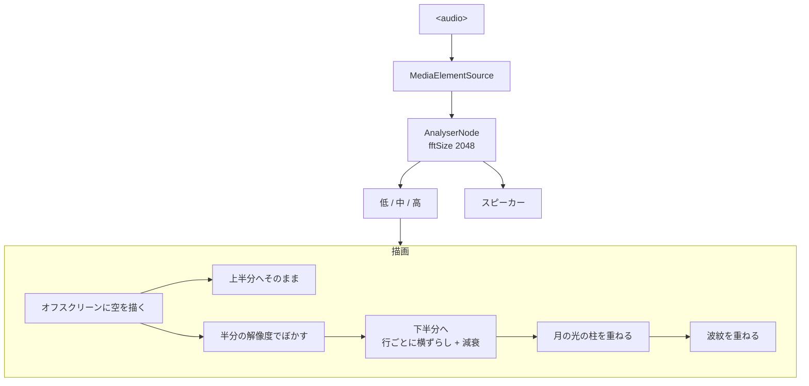

# Introspection — 水面と反射

Mona Wonderlick「[Introspection](https://youtu.be/UZzuVt7nKOA)」を題材にした、音に反応するジェネラティブアート。

**<https://bubbleshaker.github.io/introspection-art/>**

「内省」を、自分を映して見つめる鏡としての水面に置き換えている。
空でおきたことは、必ず揺れる水面にも現れる。

## 作り

音を三つの帯域に畳んで、それぞれ別のものに効かせている。

| 帯域 | 範囲 | 効かせる先 |
| --- | --- | --- |
| 低 | 20–160 Hz | 波紋の発生、水面のうねりの大きさ |
| 中 | 160–2000 Hz | 月の大きさ、全体の明るさ |
| 高 | 2–8 kHz | 光の粒の明滅、水面のきらめきの速さ |



水面が水に見えるかどうかは、ほぼ二つの仕掛けで決まっている。

1. **反射元をぼかす** — 空をそのまま写すと、星のような点が水面でも点のまま残り、
   スライスのずれと相まって階段状の粒に見える。一度ぼかしてから写すと、
   点は滲んだ光になり、月の明るい塊だけが形を保つ。
2. **光の柱を別に描く** — 転写だけでは月はただの滲んだ塊にしかならない。
   実際の水面では波の一つひとつが小さな鏡になり、たまたま月をこちらへ返した面だけが光る。
   それを、行ごとに散らした短い横線の集まりとして描いている。

## 動かす

```sh
npm ci
npm run dev
```

`public/audio/introspection.mp3` を置くと自動で読み込む（[置き場所の説明](public/audio/README.md)）。
無い場合でも画面は成立し、mp3 を画面にドロップすればその曲に反応する。

```sh
npm test    # 純粋な計算部分（帯域の切り出し、打点検出、波紋の減衰）
npm run build
```

## クレジット

Music: **Introspection** — Mona Wonderlick (YouTube Audio Library)
