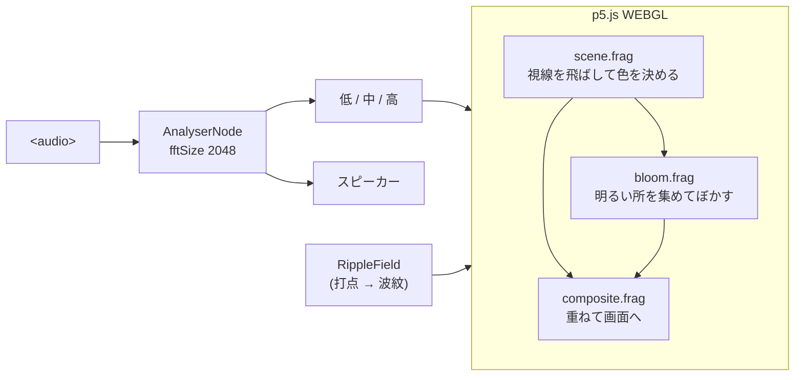

# Introspection — 水面と反射

Mona Wonderlick「[Introspection](https://youtu.be/UZzuVt7nKOA)」を題材にした、音に反応するジェネラティブアート。

**<https://bubbleshaker.github.io/introspection-art/>**

「内省」を、自分を映して見つめる鏡としての水面に置き換えている。
空でおきたことは、必ず揺れる水面にも現れる。

## 作り

音を三つの帯域に畳んで、それぞれ別のものに効かせている。

| 帯域 | 範囲 | 効かせる先 |
| --- | --- | --- |
| 低 | 20–160 Hz | 波の高さ、波紋の発生 |
| 中 | 160–2000 Hz | 月の大きさ、雲の照り、光の溢れ |
| 高 | 2–8 kHz | 星の瞬き、水面のきらめきの速さ |

絵は p5.js の WEBGL モードで、**画面いっぱいの板 1 枚に貼った
フラグメントシェーダー**が描く。3D のモデルは置いていない。
ピクセルごとに視線を 1 本飛ばし、それが空へ抜けるか水面に当たるかで色を決める。

```
      ＼      ← 空へ抜ける視線 : skyColor(rd)
       ＼
  目 ●──────── 水平線
       ／＼
      ／  ＼  ← 水面に当たる視線
  ～～～～～～～ 水面 (y = 0)
```



肝は **`skyColor(dir)` という関数を、空の描画と水面の反射で共用している**こと。
水面のある点で波の法線を求め、視線を反射させ、その方向の空を同じ関数で引く。
反射を別に描き直すのではなく同じ空を引くので、
「空で起きたことは水面にも現れる」が転写ではなく計算で成り立つ。

水面らしさは、主に三つの仕掛けから出ている。

1. **フレネル反射** — 光が水面で反射する割合は、視線の角度で変わる。
   浅く当たる遠くの水面はほとんど鏡になって空を映し、視線が立つ手前は
   水の底の暗さが出る。奥行きを係数で作らなくても、ここから自動的に出る。

2. **消した細部を、光の広がりへ振り替える** — 遠方は 1 ピクセルに何十もの波が
   入るので、そのまま描くと水平線際が白くちらつく。かといって細かい波を
   消すだけだと、遠くはただの鏡になってしまう。消したぶんの「暴れ」を
   持ち帰って月の像を広げ、そのぶん薄める。遠くの月の道がぼんやり滲むのは
   これによる。

3. **波を尖らせる** — 正弦波のままだと山と谷が同じ形になり、水よりゼリーに見える。
   `((sin+1)/2)²` にすると山が細く立ち、谷が広く平らになる。

光が滲むのは、実際に明るい画素を集めて散らしているから（明部抽出 → ぼかし → 加算）。
そのためにシーンを一度フレームバッファへ描く三段構えになっている。

### 音の側は触っていない

`src/audio/` と `src/core/` は描画の作り替えを通して据え置き。
シーンへ `Levels`（低・中・高）を渡す口が変わらないので、
帯域の切り出し・打点検出・波紋の減衰のテストはそのまま生きている。

波紋の半径の伸び方と薄れ方も `src/scene/ripples.ts` に残してある。
シェーダーへは「今の位置・今の半径・今の強さ」だけが届く。

### 重い端末では粗くする

この絵の重さは、ほぼピクセル数に比例する。フレーム時間の中央値を見て、
遅ければ描画の細かさを 1 段落とす（2 → 1.5 → 1 → 0.75）。一度落としたら戻さない。
境目で上げ下げを繰り返すと、そのたびにキャンバスを作り直して余計に重くなる。

シェーダーは GLSL ES 3.00 で書いているので **WebGL2 が要る**。
無い環境では絵を描かず、その旨を伝えて音だけ鳴らす。

## 動かす

```sh
npm ci
npm run dev
```

`public/audio/introspection.mp3` を置くと自動で読み込む（[置き場所の説明](public/audio/README.md)）。
無い場合でも画面は成立し、mp3 を画面にドロップすればその曲に反応する。

```sh
npm test    # 純粋な計算部分（帯域の切り出し、打点検出、波紋の減衰）
npm run build
```

### シェーダーを書く時の注意

p5 が `#version 300 es` を足してくれるのは組み込みのシェーダーだけで、
`createShader()` に渡したものには手が入らない。自分で、しかも 1 行目に書く。

- `#version 300 es` と `precision` は自分で書く（前に何か置くと通らない）
- `attribute` / `varying` ではなく `in` / `out`
- `gl_FragColor` ではなく自前の `out vec4`
- `texture2D()` ではなく `texture()`
- `sample` は予約語なので変数名に使えない

## クレジット

Music: **Introspection** — Mona Wonderlick (YouTube Audio Library)
