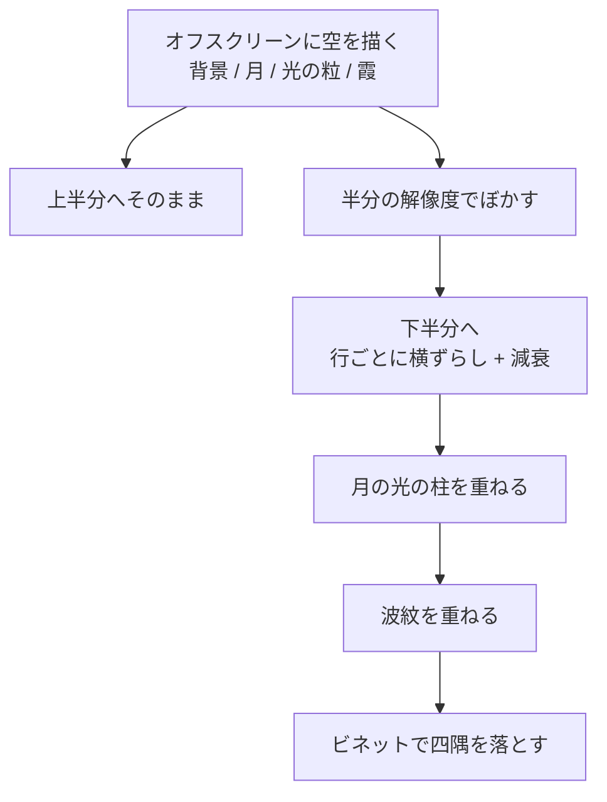

# 水面と反射 — 実装の概要

2026-08-17。Issue #1 / PR #2、Issue #3 / PR #4。
公開先: <https://bubbleshaker.github.io/introspection-art/>

Mona Wonderlick「[Introspection](https://youtu.be/UZzuVt7nKOA)」を題材に、
「内省 = 自分を映して見つめる鏡」を水面として描いた。

## どこを信頼してよいか

読むときに全部を追う必要はない。層はこう分かれている。

| 層 | ファイル | 中身 |
| --- | --- | --- |
| 共有の約束 | `src/core/levels.ts` | 低・中・高の三つの値。音声も描画もここだけを向く |
| 音を測る | `src/audio/bands.ts`, `onset.ts` | **純粋な計算**。テストがある。ここは信頼してよい |
| 音を鳴らす | `src/audio/engine.ts`, `bandAnalyser.ts`, `track.ts` | ブラウザ API の配線。薄い |
| 描く | `src/scene/waterScene.ts` ほか | 画のすべて。ここだけが重い |
| 組み立て | `src/main.ts` | 上を繋いで毎フレーム回す |

つまり **`waterScene.ts` 以外は薄い**。画を変えたければそこだけ見ればよい。

## 画の作り

空を一度オフスクリーンに描き、それを下半分へ転写する。反射を独立に描き直すのでは
なく元の光景を写すので、**空でおきたことは必ず水面にも現れる**。

転写を `lighter`（加算）で行っているのが要点で、暗い夜空の部分はほとんど何も足さず、
月や光の粒だけが水面に滲み出る。アルファ合成だと水の深い色が反射の暗部で上書きされて濁る。

### 水に見せるための二つの仕掛け

作ってみて分かったのは、素直に転写しただけでは**まったく水に見えない**ということ。
効いたのは次の二つだった。

1. **反射元をぼかす**（`updateMirror`）
   空をそのまま写すと、星のような点が水面でも点のまま残り、スライスのずれと
   相まって階段状の粒に見える。一度ぼかしてから写すと、点は滲んだ光になり、
   月の明るい塊だけが形を保つ。半分の解像度で持つことで、縮小そのものが軽い
   ぼかしになり、毎フレームかけるブラーの対象も 1/4 の面積で済む。

2. **光の柱を別に描く**（`drawLightPath`）
   転写だけでは月はただの滲んだ塊にしかならない。実際の水面では波の一つひとつが
   小さな鏡になり、たまたま月をこちらへ返した面だけが光る。それを、行ごとに
   散らした短い横線の集まりとして描いた。手前ほど広がるので柱は三角に開く。

## 音の写像

| 帯域 | 範囲 | 効かせる先 |
| --- | --- | --- |
| 低 | 20–160 Hz | 波紋の発生（打点検出）、水面のうねりの大きさ |
| 中 | 160–2000 Hz | 月の大きさ、全体の明るさ、水平線の輝き |
| 高 | 2–8 kHz | 光の粒の明滅、水面のきらめきの速さ |

平滑化は「上がる時は速く、下がる時はゆっくり」。音が切れても余韻が水面に残る。

## つまずいたところ

### 読み込みの完了を待って「音源が在るか」を決めてはいけない

当初 `canplay` を待って判定していた。これは待ち続けて入口が開かなくなる危険が
あり、かといって待ち時間に上限を置くと今度は遅い回線で「在るのに無い」と誤表示する
（検証環境で実際に、`loadedmetadata` が 60 秒以上来ないケースを踏んだ）。

**存在の確認と、再生できるかは別の話**。前者は `HEAD` で確かめ（`track.ts`）、
後者は `play()` が投げるかどうかに任せる形にした。開発用サーバーが見つからない時に
`index.html` を返す件も、`Content-Type` を見て弾いている。

### 演出と機能を同じ仕組みに乗せてはいけない（#3）

入口が消えることを CSS トランジションに委ねていたため、トランジションが走らない
状況でクラスは付いているのに `opacity` が `1` のまま動かず、入口が画を覆ったまま
残った。フェードは飾りに留め、時間が過ぎたら `hidden` を立てて確実に畳むよう直した。

### 時刻に可変係数を掛けてはいけない

`sin(t * k)` の `k` を音で動かすと、`t` が大きいほど位相が飛ぶ。起動直後は目立たない
が、10 分後にはただのノイズに劣化する。毎フレームぶんだけ足して積み上げる
（`shimmerPhase`）のが正しい。

## 音源について

`public/audio/introspection.mp3` は**未配置**。公式の無料ダウンロード
（Hypeddit）が SNS のフォローを条件にしており、自動では取得できなかった。
置かれるまでは「音源が見つかりません」と案内し、ドロップを受け付ける形で成立させている。

なお、フリー BGM は「動画等で使ってよい・クレジット必須」であって、
**音源そのものの再配布は通常認められていない**。リポジトリに置いて公開配信する
場合は、その線引きを確認したうえで判断すること。
