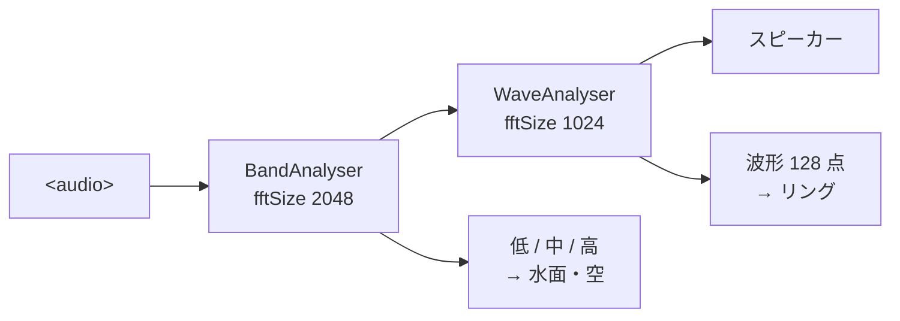

# 手前に、音に合わせた白い円形の波形を重ねた

[Issue #11](https://github.com/bubbleShaker/introspection-art/issues/11)

## 何をしたか

水面と反射の背景（GLSL の 3 パス）はそのまま残し、その手前に
音の波形を白いリングとして重ねた。画面中央、半径は画面の短い辺の 22%。

シェーダーは 1 行も触っていない。足したのは音の取り出し方が一つと、
既存の 3 パスの**後ろ**に付けた線の描画だけ。

## 詰まりどころ: 帯域では波形を描けない

今まで音から取り出していたのは FFT の三帯域（低・中・高）だけで、
これは「どれくらい強いか」しか持っていない。0.7 という値からは、
どんな形で震えているかは復元できない。

波形の**形**が要るので、時間領域のデータ（`getByteTimeDomainData`）を
別に読むことにした。同じ AnalyserNode に相乗りさせず `WaveAnalyser` を
新しく立てたのは、測っているものが別だから。片方の都合（FFT の細かさ、
前フレームとの混ぜ具合）で、もう片方の見え方が変わってほしくない。



解析ノードを**数珠つなぎ**にしているのがポイント。どちらも音を素通しするので
聞こえ方は変わらない。枝分かれさせてそれぞれスピーカーへ繋ぐと、
同じ音が二重に足されて大きくなってしまう。

## 詰まりどころ: 音の波形は輪になっていない

1024 サンプルを 128 点に畳んで、そのまま円周に配ると、
一周して戻ってきた所（始点と終点）で値が食い違い、**必ず継ぎ目が出る**。
音の波形は、たまたま切り出した 23ms ぶんでしかないので当然のこと。

左右に折り返して対称にした。128 点を半周ぶんに使い、残り半周は
それを逆にたどる。折り返した所では同じ値を二度使うので、段差が出ない。

```
   前半 →         ← 後半（前半を逆にたどる）
   wave[0] .. wave[127] wave[127] .. wave[0]
      ↑ 上から時計回り              ↑ ここで一周して wave[0] に戻る
```

これは「継ぎ目を隠す」ための妥協ではなく、対称な輪郭そのものが
背景の静けさと相性が良かった。

## 細かい判断

- **利得は tanh で受ける** — 生の振幅のままだと静かな曲でほぼ真円で止まる。
  2.6 倍に持ち上げたぶん、大音量で潰れないよう `tanh` で頭を丸めた
- **無音でも死なせない** — ごく弱い息づかい（半径の 1.3%）を足している。
  角度の 3 倍で回しているので、一周してちょうど元に戻る（ここでも継ぎ目が出ない）
- **線の太さに画素の細かさを掛けない** — p5 の `strokeWeight` はキャンバスの
  座標（CSS ピクセル）で数える。`pixelDensity` を掛けると、画質を落とした端末で
  線だけ細くなる
- **リングが転んでも背景は続ける** — 飾りの失敗で画面ごと真っ暗にしないよう、
  背景の 3 パスとは別の `try` に入れ、以後リングだけ飛ばす

## 置き場所

幾何（折り返し・利得・息づかい）は `src/scene/waveRing.ts` の純粋関数に出した。
`ripples.ts` や `camera.ts` と同じ扱いで、p5 も WebGL も知らない。
おかげで「継ぎ目ができない」「振れ幅を越えて暴れない」を単体テストで確かめられる。

| ファイル | 役割 |
| --- | --- |
| `src/audio/waveform.ts` | 0..255 のサンプル列 → -1..1 の 128 点（純粋） |
| `src/audio/waveAnalyser.ts` | AnalyserNode を持ち、時間領域を読む |
| `src/scene/waveRing.ts` | 波形 → 輪郭の点列（純粋） |
| `src/scene/gl/glScene.ts` | 出来た点を線でなぞる。3 パスの後 |

## 確かめ方

`npm test` は 68 件。加えて、110Hz の正弦波を作ってファイル選択の口へ流し込み、
ヘッドレスブラウザで実際に輪郭が変わることを見ている。
