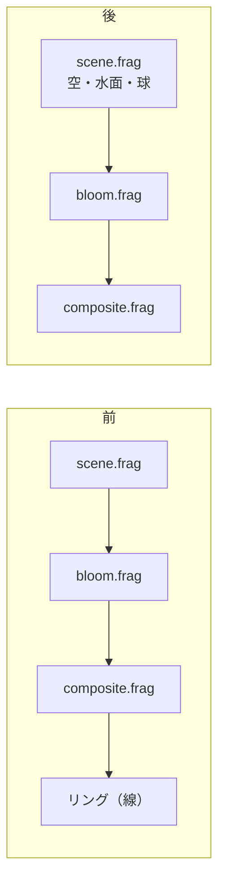

# 円形の波形を、立体の球にした

[Issue #13](https://github.com/bubbleShaker/introspection-art/issues/13)

## 何をしたか

画面中央に線で描いていた平らな白いリングをやめ、**水面のすぐ上に浮かぶ
球**に置き換えた。表面には波模様があり、時間とともに流れる。

置き場所を変えたのが一番大きい。リングは 3 パス（シーン → ブルーム → 合成）が
**終わったあとに** p5 の線で描く「後乗せの飾り」だった。球は
`scene.frag.glsl` の中、**いちばん最初の段**にいる。



段が変わったことで、頼まなくても付いてくるものがある。

- 月を映す（`skyColor()` を空・水面と共用しているため）
- 波頭が滲む（ブルームより前にいるため）
- 水面に映り込む（水面の反射レイでも球の交差を見ているため）

## 設計: 3D モデルは置いていない

p5 の `sphere()` は使わなかった。使うと世界が二重になり、
「空で起きたことは水面にも現れる」という作品の芯が切れる。

代わりに、視線と球の交差を解いた。球は丸ごと水面より上にあるので、
**当たったならそれは必ず水面より手前**。距離を比べずに球を先に見てよい。

```
      ＼      ← 空へ抜ける視線 : skyColor(rd)
       ＼  ●  ← 球に当たる視線 : sphereColor(...)
  目 ●──────── 水平線
       ／＼
      ／  ＼  ← 水面に当たる視線（反射の先でも球を見る）
  ～～～～～～～ 水面 (y = 0)
```

表面の波は、形を動かさずに**傾き（法線）だけを差し替える**。水面と同じやり方で、
レイマーチしないので交差は二次方程式で済む。波は三つの重ね合わせ。

| 層 | 何を表す | 出どころ |
| --- | --- | --- |
| `fbm3` のうねり | 流動 | シェーダー内の 3 次元ノイズ |
| 緯度に沿った縞 | うねりに押し曲げられて流れる | 同上 |
| 経度に沿った畝 | 音への反応（旧リングの役目） | `waveSphere.ts` → uniform |

## 詰まりどころ 1: 波模様が見えない

最初、水面と同じ組み立て（法線 → 反射 → `skyColor()` → フレネル）だけで
描いたら、**球が真っ黒な円盤になった**。

理由は視線の角度にある。水面が美しく光るのは、遠くを浅い角度で見ていて
フレネル反射率が 1 に近いから。ところが球の正面は視線が垂直に当たるので
反射率は 2% ほどしかなく、しかもその 2% で映しているのは
「カメラの後ろ側の空」＝暗いところだった。

では物体として照らせばよいかというと、そうもいかない。月は球の**向こう側**に
あるので、`dot(法線, 月の方向)` はこちらを向いた面すべてでほぼ同じ値になり、
のっぺりした灰色の球になった（この時は逆光の透過項も入れていて、
それも角度でほとんど変化せず、平たさに加担していた）。

落としどころは「物理の言葉で照らす」ことをやめて、**波の山だけを抜き出して
光らせる**ことだった。

```glsl
float ridge  = smoothstep(0.50, 1.0, crest);            // 山だけ
float toward = 0.18 + 0.82 * (dot(normal, uMoonDir) * 0.5 + 0.5);  // 月の側ほど強く
float limb   = pow(1.0 - abs(dot(rd, q)), 1.4);         // 縁ほど強く（丸みが出る）
col += MOON_TINT * ridge * toward * (0.28 + 0.72 * limb) * SPHERE_GLOW;
```

`limb` が効いた。これが無いと、光った縞が「平らな板に描いた模様」に見えて
球の丸みが消える。加えて、月と視線のちょうど真ん中を向いた面だけが光る
鋭い反射（ハーフベクトル）を足すと、うねりに合わせて光の位置が動き、
模様が生きて見えるようになった。

## 詰まりどころ 2: 半径が向きで変わると解けない

波形で球を膨らませると（輪郭が音に合わせて揺れる）、半径が向きの関数になり、
交差が二次方程式ひとつでは解けなくなる。

輪郭の形を決めているのは「視線が中心にいちばん近づく点の向き」なので、
まずそこの半径で球を切り、出てきた交点の向きでもう一度切り直す 2 段構えにした。
膨らみが半径の 1 割ほどなら、これでほぼ収まる。

ここで一度、**輪郭の内側に細い隙間**が出た。切り直した半径の方が小さいと
視線がその球を外し、「当たらなかった」が返って背景が透けるため。
一度当たっている以上そこに表面はあるので、外れた時は 1 段目をそのまま使う。

```glsl
float refined = sphereHit(ro, rd, sphereRadiusAt(hitDir));
if (refined <= 0.0) return t;   // 穴を空けない
```

## 詰まりどころ 3: 極で模様がちらつく

波形は経度（縦軸まわりの角度）で引いている。真上と真下では経度が定まらず、
極の一点に輪の全部の値がぶつかる。赤道からの遠さで細めて（`sqrt(1 - y²)`）、
極で 0 になるようにした。

また、輪の隣り合う 2 点を直線補間すると、その値を微分して作る法線の傾きが
128 か所で飛び、球が多面体に見える。`3t² - 2t³` で混ぜて滑らかにしている。

## 残したもの・畳んだもの

| ファイル | 扱い |
| --- | --- |
| `src/audio/`, `src/core/` | 据え置き（波形の取り出し方は変えていない） |
| `src/scene/ripples.ts` | 据え置き |
| `src/scene/waveRing.ts` | 削除。`waveSphere.ts` へ |
| `glScene.ts` の線描画 | 削除。絵は 3 パスのシェーダーだけになった |

`waveSphere.ts` が返すものは「画面上の点列（x, y）」から「向き → 高さ」に
変わった。点の位置はシェーダーの交差判定が出すので、JS 側はもう座標を知らない。
波形を折り返して継ぎ目を消すこと・`tanh` で受け止めること・無音でも息づくことは、
テストごとそのまま引き継いでいる。

## uniform の渡し方

波形 128 点は `float` を 128 本並べず、`vec4[32]` に詰めて渡している
（実装によっては uniform の本数の上限に触るため）。シェーダー側は
`uWave[i >> 2][i & 3]` で引く。GLSL ES 3.00 なら、配列にもベクトルの成分にも
動的な添字を使える。
