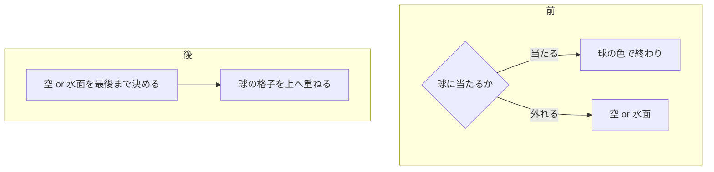

# 波形の球を、格子の骨組みにして透かした

[Issue #15](https://github.com/bubbleShaker/introspection-art/issues/15)

## 何をしたか

球の**面をやめた**。緯線と経線だけを残し、線と線の隙間からは背後の海と空が
そのまま透ける。音の波形は、面の凹凸ではなく**骨組みの歪み**として現れる。

向こう側の線も描いているので、中が空洞であることが形として分かる。

| | 前（#13） | 後 |
| --- | --- | --- |
| 球の見え方 | 面のある不透明な塊 | 緯線・経線の骨組みだけ |
| 背後の海 | 輪郭の内側では見えない | 線の隙間から透ける |
| 波形の出し方 | 表面の陰影（縞の山を光らせる） | 緯線のうねり＋輪郭の脈動 |
| 表面の細部 | `fbm3` のうねり＋緯度の縞＋経度の畝 | 格子を押し曲げる `fbm3` のうねりだけ |

## 設計: 描く順を裏返した

透かすために変わったのは、色を決める**順序**である。



前は「球に当たったら背景は描かない」構造だったので、そもそも透かしようが
なかった。今は背景を先に決め切り、格子を色とアルファ（線の覆い）で乗せる。

```glsl
vec4 wire = sphereWire(ro, rd, 0.0);
col = mix(col, wire.rgb, wire.a);   // 線の無いところは a = 0 で、背景がそのまま残る
```

水面の反射でも同じ関数を通すので、映り込みも格子だけになり、その隙間からは
**映った空**が覗く。

交差判定（波形で膨らむ球）は #13 のものをそのまま使っている。違うのは、
手前だけでなく**向こう側の交点も取る**ようになったこと。`sphereHit()` に
`farSide` を足し、奥の面を先に敷いてから手前の面を重ねる。

## 詰まりどころ 1: 線の太さを何で測るか

線を「球面上の長さ」で太らせると、球を斜めから見るところ（＝輪郭）では
画面上でどんどん細り、1 ピクセルを割って点滅する。かといって画面上の
太さで測ると、球面のどこにいるかが分からなくなる。

球面上の長さで測ったまま、**1 ピクセルがその面を覆う長さ**を距離と傾きから
出して、その幅で滲ませた。

```glsl
// 1 ピクセルの見込み幅。水面の反射として見ている時は、水面が捨てた暴れも足す
float spread = (1.0 / uResolution.y + surfaceBlur) * t / SPHERE_RADIUS;
float aa     = spread / max(abs(dot(rd, q)), 0.12);   // 寝ている面ほど広く覆う
```

`fwidth()` を使わなかったのは、交点が分岐の中で決まるため。当たらない
ピクセルと混ざった微分は当てにならない。距離と傾きからは素直に出せる。

## 詰まりどころ 2: 極と輪郭で線が白い塊に固まる

滲ませるだけだと、線は画面上でいくら細っても**真芯の濃さを保つ**。
経線が集まる極と、線が寝て潰れる輪郭で、濃い線が重なって白い塊になった。

滲みが線の太さを超えたぶんだけ、濃さを落とすようにした。縮んだ絵を薄くする、
縮小して重ねる時の当たり前の作法である。

```glsl
return line * mix(0.34, 1.0, min(1.0, WIRE_WIDTH * 3.0 / max(aa, 1e-5)));
```

`0.34` を下限にして消しきらない。輪郭は線がいちばん潰れるところだが、
同時に球の丸みを見せている骨でもあるので、薄い帯として残す。

極そのものは、経度が定まらないぶん `smoothstep(0.06, 0.45, around)` で
経線を薄めて逃がしている（#13 で波形を極で細めたのと同じ考え）。

## 詰まりどころ 3: 波形が格子を絡ませる

緯線を波形で押し上げる強さ（`WIRE_RIB`）を 0.55 にしたら、押された緯線が
隣を追い越して**格子が縦に絡まった**。線は面と違って、交わり方そのものが
形として読まれる。0.26 に落として、緯線 1 本ぶんの間隔の内側で波打つように
した。

同じ理由で、格子の目も粗くした（経線 24 → 20、緯線 14 → 12）。細かい格子は
線が主役になった途端「かご」に見える。

## 削ったもの

| 関数・定数 | 理由 |
| --- | --- |
| `sphereWave()` / `sphereNormal()` | 面の陰影のためのもの。線には面が無い |
| `SPHERE_BAND_FREQ` / `SPHERE_WAVE_AMP` / `SPHERE_RIB` | 同上（`WIRE_*` へ置き換え） |
| `sphereColor()` | `wireColor()` + `wireCoverage()` + `sphereWire()` へ |

`fbm3()` は残した。法線を作るために 1 つの面につき 4 回呼んでいたものが、
格子を押し曲げるうねりとして 1 回で済む。面が 2 枚（表と裏）になったので
1 ピクセルあたりでは 8 回 → 4 回で、球のピクセルはむしろ軽くなっている。

`src/audio/`, `src/core/`, `src/scene/waveSphere.ts` は触っていない。
シェーダーへ渡る波形の作り方は #13 のまま。

## レビューで直したもの

`reviewer` サブエージェントの指摘のうち、実装に反映したもの。

| 指摘 | 直し方 |
| --- | --- |
| 極で `atan(0, 0)` が無防備。NaN が 1 ピクセルでも出るとブルームが面へ広げる | `waveAt()` と同じく `around > 1e-6` で先に逃がす。`smoothstep` で 0 を掛けても `NaN * 0` は `NaN` のままなので、掛け算では消せない |
| 水面の反射から見た格子の滲みが足りず、遠景で点滅する | 1 ピクセルの見込みに `surfaceBlur` を足す。`wireColor()` は受け取っていたのに `wireCoverage()` が受け取っていなかった |
| 向こう側の面で法線が裏返っていて、フレネルが 1.0 に張りついていた | `wireLayer()` で `farSide` なら法線を反転して渡す |
| `pow()` の底が正規化誤差で負になりうる | `max(..., 0.0)` を一枚かませる |
| README / PLAN が、消えた `sphereColor()` を現在形で説明していた | 両方とも現状に書き直した |
