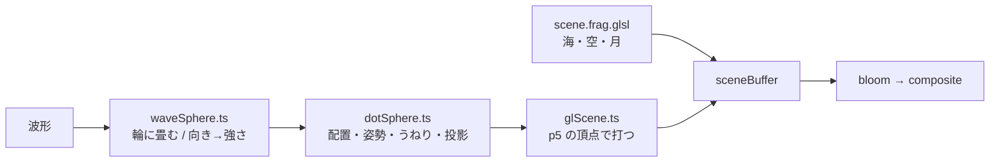

# 球の波形を、点の格子がうねる「ウェイブ」にした

[Issue #21](https://github.com/bubbleShaker/introspection-art/issues/21)

## 何をしたか

球の骨組みを**格子線から点の格子へ**変え、音の波形を**濃さではなく形**に出した。
参考にしたのは AviUtl のカスタムオブジェクト「ウェイブ」で、点の格子でできた面が
音に合わせてうねる表現である。

| | 前（#19） | 後 |
| --- | --- | --- |
| 骨 | 平行な平面で切った格子線 | 球面におよそ等間隔で並べた点（22 行・614 点） |
| 音の出かた | 線の**濃さ**が上下する | 点が**半径方向にうねる**（±22%） |
| 輪郭 | いつでも真円 | 波形の凹凸を持った、脈打つ円 |
| 球を持つ場所 | `scene.frag.glsl`（GPU） | `dotSphere.ts`（TypeScript） |

`#15`〜`#19` では「形を歪ませると輪郭がヨレる」を理由に濃さへ寄せていた。
今回それを形へ戻せたのは、**ヨレていたのが面と輪郭線だったから**である。
点にはどちらも無い。

## 設計: 球を GPU から TypeScript へ移した

面をうねらせると、レイと球の交差が解析では解けなくなる（レイマーチが要る）。
点は面ではないので、そもそも交差を解く必要がない。



副産物として、球の姿勢（`spinMatrix`）と波形の読み出し（`waveAt`）が
GLSL から**テストの書ける側**へ来た。`scene.frag.glsl` は 748 行から 396 行になり、
海と空と月だけを持つようになった。

## 点の並べ方

緯度経度の素直な格子は極へ点が密集する（同じ個数を、短くなる一方の緯線へ並べるため）。
行ごとに個数を変えて、経度方向の間隔を緯度方向の間隔へ揃えている。

```
行 i の緯度 θ = π(i + 0.5) / 行数
その行の個数  = 2 × 行数 × sin(θ)     ← 緯線の長さに比例
```

隣の行とは半分ずらす。縦に揃うと、たまたま並んだ列が筋に見えるため。

## 踏んだ穴

**面へ描くあいだ、p5 の y は上下が逆になる。**
`Framebuffer` はテクスチャの向きに合わせて軸を裏返しているので、画面へ直に描く
つもりの座標で打つと、球だけが水平線を挟んで反対側へ回る。最初の実装では月との
間隔が設計の 0.1 に対して 0.17 になっていて、そこで気付いた。
`scale(1, -1)` で裏返し返している。

**点の明るさは、シェーダーの圧縮を通らない。**
点はシェーダーの後から重ねるので、`col / (1 + col)` を通らない。線だった頃の
0.95 をそのまま置くと、圧縮を受けた背景に対して明るすぎ、ブルームにも拾われて
煙に見える。`DOT_LUMA` には**圧縮を通した後の値**（0.487）を置いてある。

## 二つのファイルに跨がる取り決め

黙って壊れるものはテストで留めてある。今回、留める先が移った。

| 取り決め | 前 | 後 |
| --- | --- | --- |
| 回る速さ | `glScene.ts` × `scene.frag.glsl` | `glScene.ts` × `dotSphere.ts` |
| 滲みに拾われない明るさ | `scene.frag.glsl` × `bloom.frag.glsl` | `glScene.ts` × `bloom.frag.glsl` |
| 輪の点の数 | `waveSphere.ts` × `scene.frag.glsl` | `waveSphere.ts` の中で閉じた |

## 手の入れどころ

`dotSphere.ts` の頭に並んだ定数がすべて。

- `DOT_ROWS` — 行の数。点の総数はおよそ 1.27 × 行数²
- `WAVE_AMOUNT` — うねりの深さ。0.4 を越えると球の面が読めなくなる
- `DOT_SIZE` — 点の大きさ。小さいと霞み、大きいと行が線に戻る
- `DOT_BACK` — 向こう側の点の薄さ。中が空いて見えるかを決める
